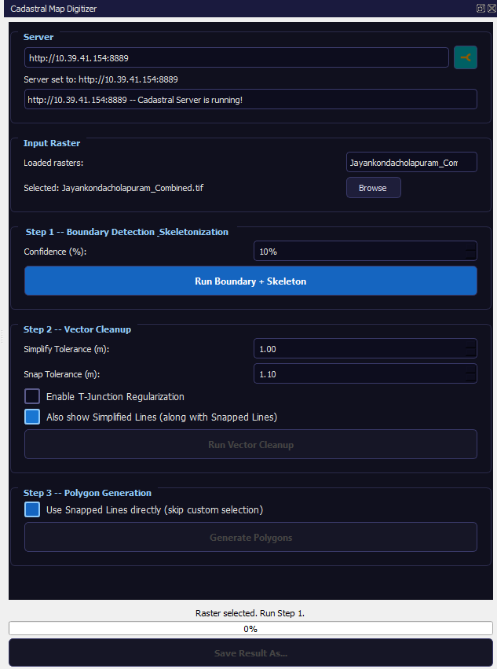
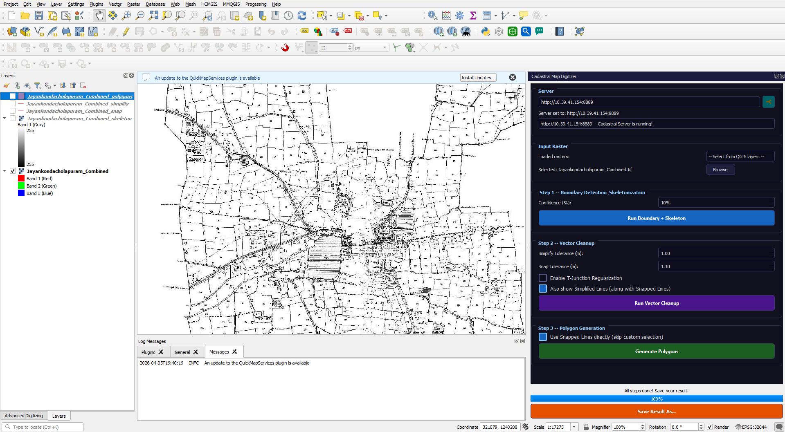
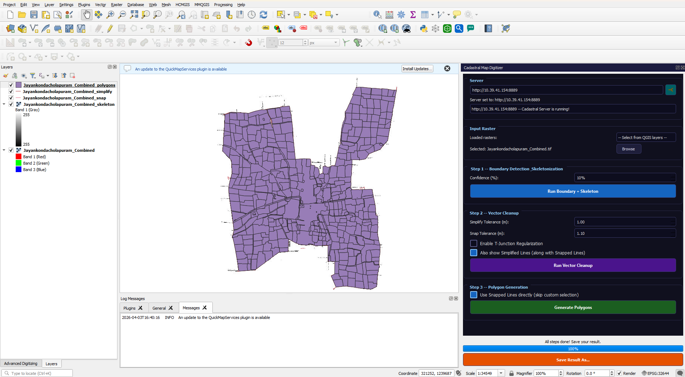

# cadastral-digitizer-qgis-plugin

End-to-end cadastral digitization system using Attention U-Net, Flask, and a QGIS plugin to convert scanned maps into polygon GIS layers.

---

## 🚀 Features
- Parcel boundary detection using Attention U-Net
- Skeleton → Polyline → Polygon conversion
- QGIS plugin integration
- Flask-based backend processing

---

## ⚙️ Workflow
Scan Map → Model Prediction → Skeleton → Polyline → Polygon

---

## 📸 Demo

### QGIS Plugin Interface

### Input Map

### Output Polygon

---

## 🧠 Tech Stack
- Python
- OpenCV
- Deep Learning (U-Net)
- Flask
- QGIS

---

## ⚠️ Note
Model weights and large datasets are not included.

---

## 👨‍💻 Author
Stephen Paul R
